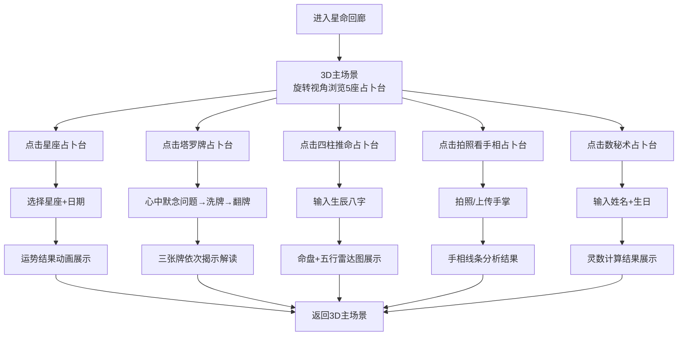

## 1. 产品概述

「星命回廊」是一款融合了东西方5种占卜方式的3D交互式占卜网站。用户在一个沉浸式3D空间中自由选择不同的占卜玩法，每次占卜都有独特的视觉动画和仪式感，像玩游戏一样让人欲罢不能。目标用户是对神秘学、占卜、自我探索感兴趣的年轻人。

## 2. 核心功能

### 2.1 用户角色
本项目为免登录即玩模式，无需注册。所有用户均为游客身份，可直接使用全部功能。

### 2.2 功能模块

1. **3D主场景（首页）**：5座占卜台分布在3D空间中，用户可旋转视角选择任一占卜台进入
2. **星座占卜**：选择星座和日期，获取当日/明日/本周运势
3. **塔罗牌占卜**：经典三牌阵型，翻牌动画揭示过去/现在/未来
4. **四柱推命**：输入出生年月日时，生成四柱命盘与五行分析
5. **拍照看手相**：上传/拍摄手掌照片，AI解读手相线条
6. **数秘术**：输入姓名和生日，计算生命灵数与命运数字

### 2.3 页面详情

| 页面名称 | 模块名称 | 功能描述 |
|----------|----------|----------|
| 3D主场景 | 旋转星盘大厅 | Three.js 3D场景，5座发光占卜台环形排列，可拖拽旋转视角，悬停高亮，点击进入对应占卜 |
| 3D主场景 | 粒子星空背景 | 动态粒子星空，营造神秘氛围 |
| 3D主场景 | 浮动导航提示 | 每个占卜台上方显示名称和图标，悬停时放大 |
| 星座占卜 | 星座选择轮盘 | 12星座3D圆盘，旋转选择 |
| 星座占卜 | 运势结果展示 | 卡片翻开动画，显示综合/爱情/事业/健康运势，星级评分 |
| 塔罗牌占卜 | 洗牌动画 | 3D牌组洗牌特效，随机抽取3张 |
| 塔罗牌占卜 | 翻牌揭示 | 依次翻开3张牌，每张有正逆位判断和详细解读 |
| 四柱推命 | 生辰输入表单 | 年/月/日/时选择器 |
| 四柱推命 | 命盘展示 | 天干地支四柱表格+五行雷达图+简要解读 |
| 拍照看手相 | 拍照/上传界面 | 模拟相机取景框，支持拍照或上传照片 |
| 拍照看手相 | 手相分析结果 | 生命线/智慧线/感情线标记+解读卡片 |
| 数秘术 | 信息输入表单 | 姓名+出生日期输入 |
| 数秘术 | 数字解读 | 生命灵数、命运数字、灵魂数字计算和解读 |

## 3. 核心流程

## 4. 用户界面设计

### 4.1 设计风格

- **主题色调**：深空蓝黑（#0A0A1A）为主背景，星金色（#D4A843）为强调色，紫罗兰（#7B2FBE）为点缀色
- **按钮风格**：3D悬浮按钮，带发光边缘和悬停上浮效果
- **字体**：标题使用「Cinzel」衬线体（神秘感），正文使用「Noto Serif SC」中文衬线体
- **布局风格**：3D场景为主，弹窗式占卜界面覆盖在3D场景之上
- **图标风格**：神秘学符号风格图标，配合星光粒子特效

### 4.2 页面设计概览

| 页面名称 | 模块名称 | UI元素 |
|----------|----------|--------|
| 3D主场景 | 旋转星盘大厅 | 暗黑星空背景+动态粒子，5座发光3D占卜台环形排列，鼠标拖拽旋转视角，悬停时占卜台发光增强+上浮+名称标签弹出 |
| 3D主场景 | 粒子星空背景 | 数千个缓慢移动的发光粒子，模拟深邃宇宙星空 |
| 星座占卜 | 星座选择轮盘 | 圆形3D轮盘，12星座符号环绕，流光转动动画，点击选中后放大 |
| 塔罗牌占卜 | 洗牌/翻牌 | 3D卡牌模型，洗牌时牌组飞舞，翻牌时卡牌旋转180度揭示内容 |
| 四柱推命 | 命盘展示 | 四柱表格卡片，五行雷达图（canvas绘制），渐变背景 |
| 拍照看手相 | 取景框 | 模拟相机界面，十字准星+扫描线动画 |
| 数秘术 | 数字解读 | 大号发光数字+解读文字卡片，粒子环绕数字旋转 |

### 4.3 响应式设计

- 桌面端优先设计，3D场景最佳体验
- 平板/手机端降级为2D卡片式布局，保留粒子背景和动画效果
- 触摸设备支持手势旋转和缩放

### 4.4 3D场景指南

- **环境/氛围**：深邃宇宙空间，暗色为主，点缀星光和星云色彩
- **光照设置**：环境光（微弱蓝紫色）+ 点光源（每个占卜台上方金色光照）+ 聚光灯（聚焦当前选中的占卜台）
- **相机设置**：透视相机，默认俯视45度角，可鼠标拖拽旋转（orbit controls），滚轮缩放
- **构图与焦点**：5座占卜台在圆形轨道上均等分布，中心有一座大型发光星盘作为视觉焦点
- **交互与动画**：自动缓慢旋转（idle animation），鼠标悬停放大+高亮，点击飞入过渡动画
- **后处理效果**：辉光（bloom）、粒子特效、轻微色差
- **性能预算**：总面数控制在10万以内，粒子数控制在3000以内

## 5. 占卜数据模拟

由于是纯前端项目，所有占卜结果采用「随机+规则混合」的算法生成，确保每次结果不同但符合占卜逻辑。星座运势和数秘术使用日期/姓名作为种子进行伪随机计算，塔罗牌纯随机抽取，四柱推命基于输入时间计算天干地支，手相采用模拟分析结果。