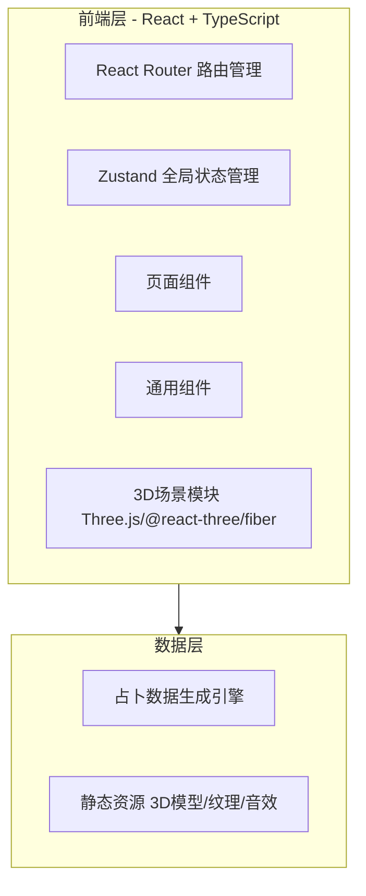

## 1. 架构设计



纯前端项目，无需后端。所有占卜逻辑和结果生成在前端完成。

## 2. 技术说明

- **框架**：React@18 + TypeScript
- **构建工具**：Vite
- **模板**：react-ts
- **样式**：Tailwind CSS@3 + CSS Modules（3D相关样式）
- **状态管理**：Zustand
- **路由**：React Router DOM v6
- **3D渲染**：@react-three/fiber + @react-three/drei + @react-three/postprocessing + three
- **图标**：lucide-react
- **动画**：framer-motion（2D UI动画）+ CSS animations + three.js 内建动画
- **存储**：localStorage（收藏的占卜结果）

## 3. 路由定义

| 路由 | 用途 |
|------|------|
| / | 3D主场景大厅 |
| /zodiac | 星座占卜 |
| /tarot | 塔罗牌占卜 |
| /bazi | 四柱推命 |
| /palm | 拍照看手相 |
| /numerology | 数秘术 |

## 4. 组件结构

```
src/
├── components/
│   ├── Scene3D/            # 3D主场景组件
│   │   ├── MainScene.tsx    # 主3D场景
│   │   ├── StarParticles.tsx # 星空粒子
│   │   ├── AltarPlatform.tsx # 占卜台3D模型
│   │   └── CentralOrb.tsx   # 中心星盘
│   ├── ui/                 # 通用UI组件
│   │   ├── Modal.tsx        # 弹窗容器
│   │   ├── GlowButton.tsx   # 发光按钮
│   │   ├── StarRating.tsx   # 星级评分
│   │   └── ParticleText.tsx # 粒子文字
│   └── layout/
│       └── PageShell.tsx    # 占卜页面通用外壳（返回按钮+背景）
├── pages/
│   ├── Home.tsx             # 3D主场景页面
│   ├── Zodiac.tsx           # 星座占卜页面
│   ├── Tarot.tsx            # 塔罗牌占卜页面
│   ├── Bazi.tsx             # 四柱推命页面
│   ├── PalmReading.tsx      # 拍照看手相页面
│   └── Numerology.tsx       # 数秘术页面
├── hooks/
│   ├── useFortune.ts        # 占卜结果生成hook
│   └── useCamera.ts         # 相机动画hook
├── store/
│   └── fortuneStore.ts      # Zustand全局状态
├── utils/
│   ├── zodiacData.ts        # 星座运势数据生成
│   ├── tarotData.ts         # 塔罗牌数据
│   ├── baziData.ts          # 四柱推命计算
│   ├── palmData.ts          # 手相模拟数据
│   └── numerologyData.ts    # 数秘术计算
├── App.tsx
├── main.tsx
└── index.css
```

## 5. 数据模型

### 5.1 占卜结果数据结构

```typescript
// 星座运势
interface ZodiacResult {
  sign: string;
  date: string;
  overall: { score: number; text: string };
  love: { score: number; text: string };
  career: { score: number; text: string };
  health: { score: number; text: string };
  luckyColor: string;
  luckyNumber: number;
}

// 塔罗牌
interface TarotCard {
  id: number;
  name: string;
  nameCN: string;
  image: string;
  upright: string;
  reversed: string;
  isReversed: boolean;
  position: 'past' | 'present' | 'future';
}

interface TarotResult {
  cards: TarotCard[];
}

// 四柱推命
interface BaziResult {
  year: { stem: string; branch: string };
  month: { stem: string; branch: string };
  day: { stem: string; branch: string };
  hour: { stem: string; branch: string };
  fiveElements: { wood: number; fire: number; earth: number; metal: number; water: number };
  analysis: string;
}

// 手相
interface PalmResult {
  lifeLine: { length: string; meaning: string };
  headLine: { length: string; meaning: string };
  heartLine: { length: string; meaning: string };
  fateLine: { present: boolean; meaning: string };
}

// 数秘术
interface NumerologyResult {
  lifePath: number;
  destiny: number;
  soul: number;
  personality: number;
  lifePathDesc: string;
  destinyDesc: string;
  soulDesc: string;
}
```

### 6.2 全局状态 (Zustand)

```typescript
interface FortuneStore {
  currentView: 'scene' | 'zodiac' | 'tarot' | 'bazi' | 'palm' | 'numerology';
  zodiacResult: ZodiacResult | null;
  tarotResult: TarotResult | null;
  baziResult: BaziResult | null;
  palmResult: PalmResult | null;
  numerologyResult: NumerologyResult | null;
  setView: (view: string) => void;
  setResult: (type: string, result: any) => void;
}
```